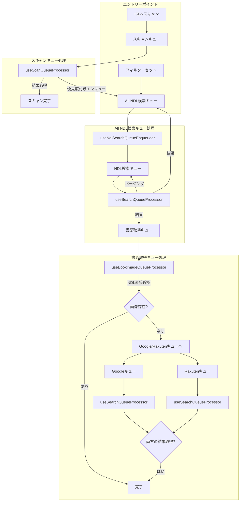
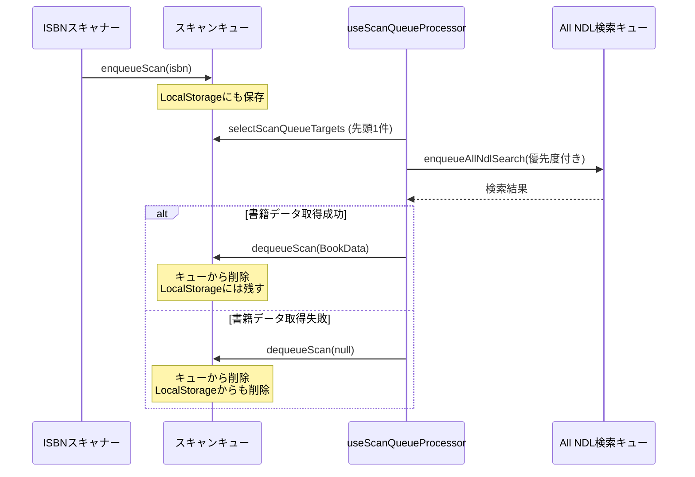
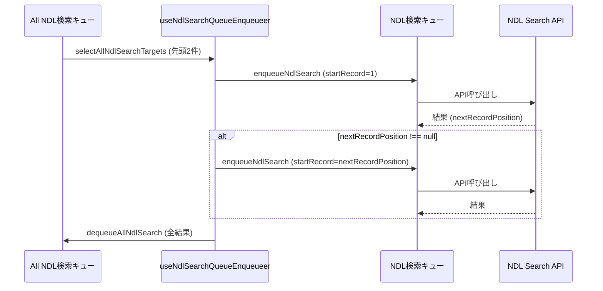
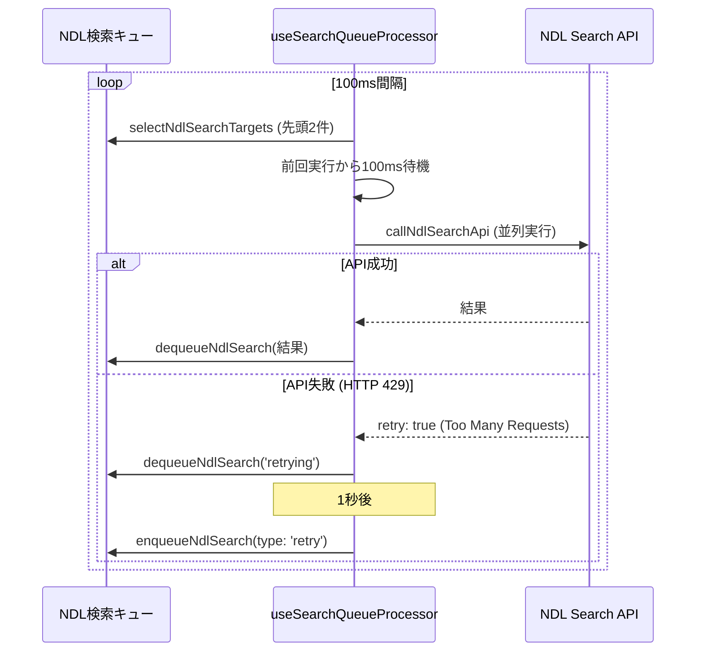
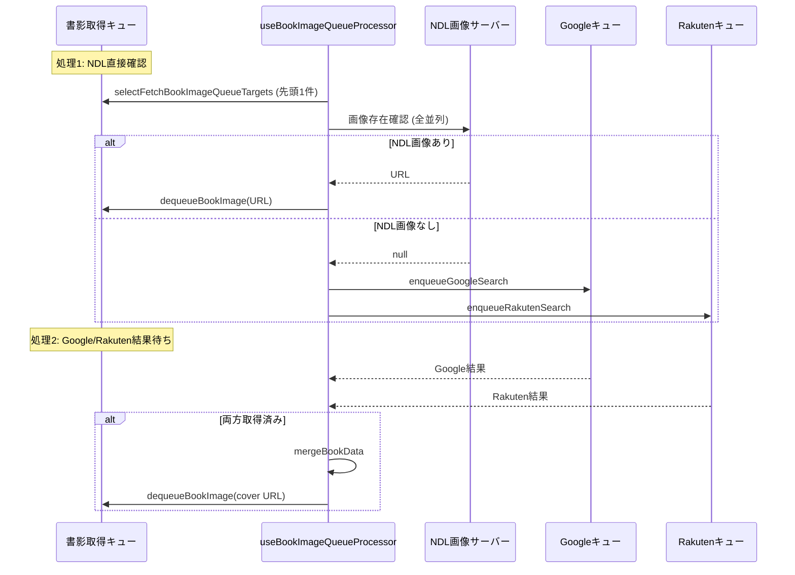
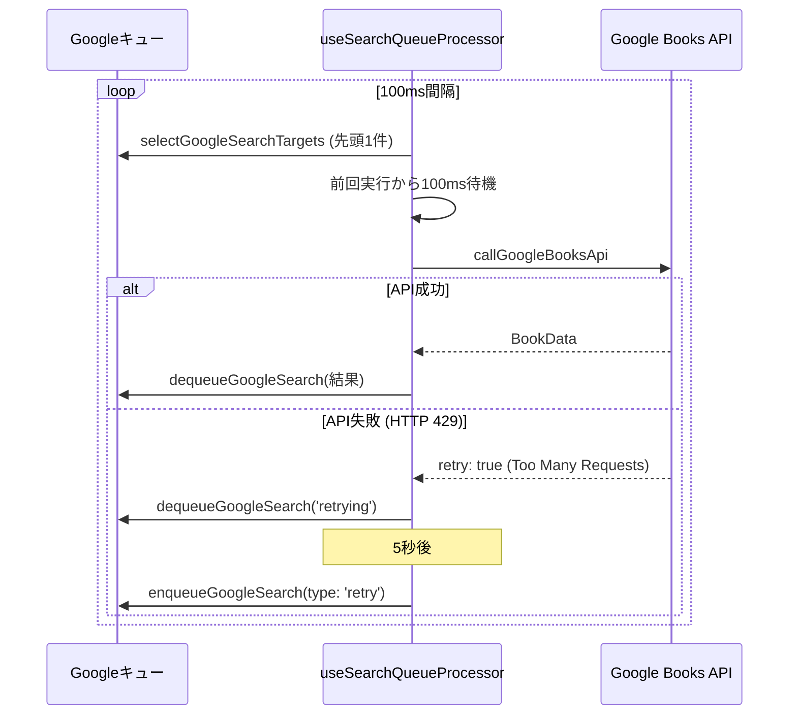
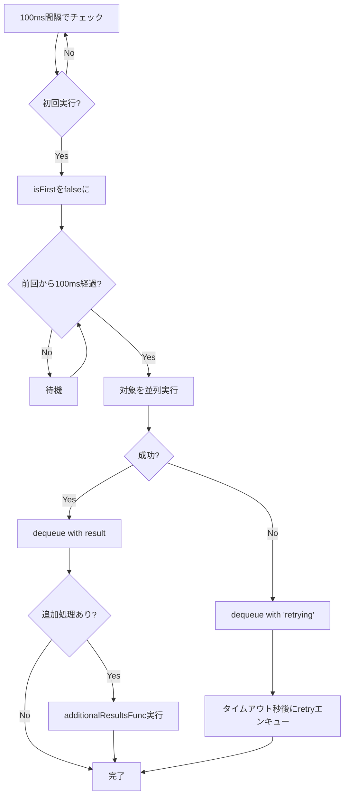
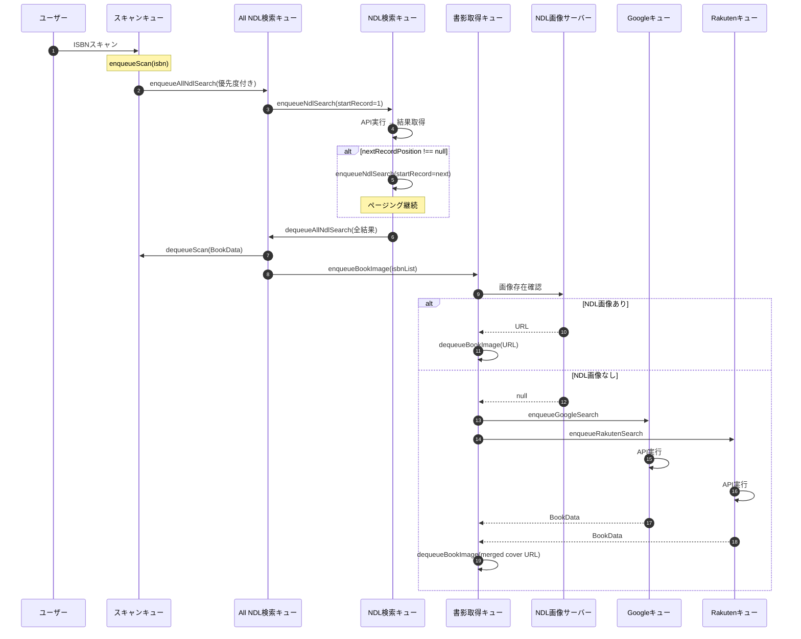
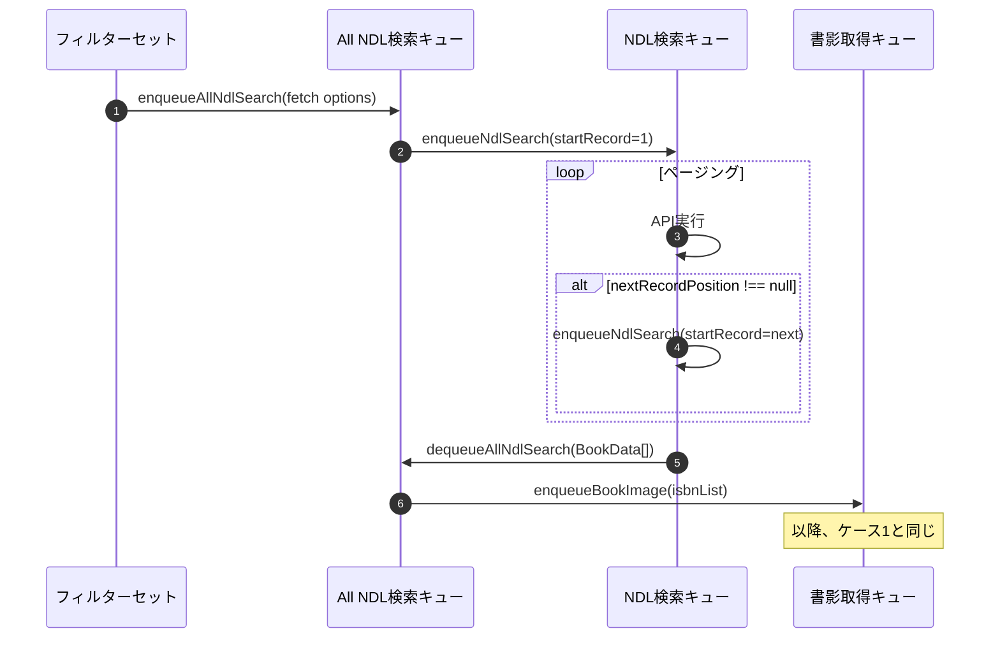

# キューイングシステム全体設計書

> **📝 ドキュメント更新について**  
> キューイングシステムを改修した際は、Claude Code に「queuing.mdを更新して」と依頼してください。  
> 詳細な更新手順は `.claude/queuing-update-guide.md` に記載されており、Claude Code が自動的に参照して更新作業を行います。

## 概要

本プロジェクトでは、外部API（Google Books API、Rakuten Books API、NDL Search API）への Too Many Request エラーを防ぐため、タスクキューイングシステムを実装しています。

## キューイングの全体像



## キュー一覧

### 1. スキャンキュー (scannerSlice)

**目的**: ISBNスキャンから書籍情報取得までの処理を管理

**キーの型**: `Isbn13` (ISBN-13コード)

**結果の型**: `BookData` (書籍データ)

#### エンキュー条件

```typescript
type: 'new'; // 新規スキャンのみ
```

#### デキュー条件

- All NDL検索キューから該当ISBNの検索結果が取得できた時
- 取得できなかった場合は null でデキュー（表示リストからは削除）

#### 処理フロー



#### 並行実行数

- **1件**: `selectScanQueueTargets` で `createQueueTargetSelector('scanner', 1)`

---

### 2. All NDL検索キュー (ndlSearchSlice)

**目的**: NDL検索APIのページング処理を含む全データ取得を管理

**キーの型**: `string` (JSON化された `NdlFetchOptions`)

**結果の型**: `BookData[]` (書籍データ配列)

#### エンキュー条件

```typescript
type: 'new'; // 新規検索
type: 'priority'; // 優先検索（スキャンやフィルター変更時）
```

#### デキュー条件

- NDL検索キューで全ページング処理が完了した時（`nextRecordPosition === null`）

#### 処理フロー



#### 並行実行数

- **2件**: `selectAllNdlSearchTargets` で `createQueueTargetSelector('ndlSearch', 2)`

#### 特記事項

- ページング処理を自動的に繰り返す
- フィルターセットが変更されるたびに再検索
- 一時コレクションの作成も担当

---

### 3. NDL検索キュー (fetchNdlSearchSlice)

**目的**: NDL Search APIへの個別リクエストを管理（ページング対応）

**キーの型**: `string` (JSON化された `NdlFetchOptions` - `startRecord` を含む)

**結果の型**: `NdlSearchResult` (リスト、総件数、次ページ位置)

```typescript
type NdlSearchResult = {
  list: BookData[];
  numberOfRecords: number | null;
  nextRecordPosition: number | null;
};
```

#### エンキュー条件

```typescript
type: 'new'; // 新規検索
type: 'retry'; // リトライ (1秒後)
type: 'priority'; // 優先検索
```

#### デキュー条件

- API呼び出しが成功した時
- リトライ対象の場合は `'retrying'` として一旦デキュー → 1秒後に再エンキュー

#### 処理フロー



#### 並行実行数

- **1件**: `selectNdlSearchTargets` で `createQueueTargetSelector('fetchNdlSearch', 1)`

#### レート制限

- **50ms間隔**: 前回API呼び出し終了から50ms経過していなければ待機

#### リトライ戦略

- **リトライ間隔**: 1秒（1000ms）
- 失敗時（HTTPステータスコード 429 検知）: 1秒後に `type: 'retry'` で再エンキュー
- 実装: `src/utils/fetch/ndl.tsx:159` でステータスコード429をチェックし `retry: true` を返す

---

### 4. 書影取得キュー (fetchBookImageSlice)

**目的**: 書籍の書影URLを取得（NDL → Google/Rakuten の優先順）

**キーの型**: `Isbn13` (ISBN-13コード)

**結果の型**: `string | null` (書影URL または null)

#### エンキュー条件

```typescript
type: 'new'; // NDL検索結果から
type: 'priority'; // 優先取得
```

#### デキュー条件

1. **NDL直接確認で画像が見つかった時** (処理1)
2. **Google/Rakuten両方の結果が揃った時** (処理2)

#### 処理フロー



#### 並行実行数

- **1件**: `selectFetchBookImageQueueTargets` で `createQueueTargetSelector('fetchBookImage', 1)`
- ただし、NDL画像確認は対象ISBN全て並列実行

#### 特記事項

- 2段階処理
  - **処理1**: NDL直接確認（高速、並列）
  - **処理2**: Google/Rakuten両方の結果を待つ（確実）

---

### 5. Google Books APIキュー (fetchGoogleSearchSlice)

**目的**: Google Books APIでISBN検索して書籍情報を取得

**キーの型**: `Isbn13` (ISBN-13コード)

**結果の型**: `BookData | 'retrying' | null`

#### エンキュー条件

```typescript
type: 'new'; // 書影取得キューから
type: 'retry'; // リトライ (5秒後)
type: 'priority'; // 優先検索
```

#### デキュー条件

- API呼び出しが成功した時
- リトライ対象の場合は `'retrying'` として一旦デキュー → 5秒後に再エンキュー

#### 処理フロー



#### 並行実行数

- **1件**: `selectGoogleSearchTargets` で `createQueueTargetSelector('fetchGoogleSearch', 1)`

#### レート制限

- **100ms間隔**: 前回API呼び出し終了から100ms経過していなければ待機

#### リトライ戦略

- **リトライ間隔**: 500ms
- 失敗時（HTTPステータスコード 429 検知）: 500ms後に `type: 'retry'` で再エンキュー
- 実装: `src/utils/fetch/index.ts:7` でステータスコード429をチェックし `retry: true` を返す

---

### 6. Rakuten Books APIキュー (fetchRakutenSearchSlice)

**目的**: Rakuten Books APIでISBN検索して書籍情報を取得

**キーの型**: `Isbn13` (ISBN-13コード)

**結果の型**: `BookData | 'retrying' | null`

#### エンキュー条件

```typescript
type: 'new'; // 書影取得キューから
type: 'retry'; // リトライ (500ms後)
type: 'priority'; // 優先検索
```

#### デキュー条件

- API呼び出しが成功した時
- リトライ対象の場合は `'retrying'` として一旦デキュー → 500ms後に再エンキュー

#### 処理フロー

Google Books APIキューと同様の処理フロー

#### 並行実行数

- **1件**: `selectRakutenSearchTargets` で `createQueueTargetSelector('fetchRakutenSearch', 1)`

#### レート制限

- **500ms間隔**: 前回API呼び出し終了から500ms経過していなければ待機

#### リトライ戦略

- **リトライ間隔**: 500ms
- 失敗時（HTTPステータスコード 429 検知）: 500ms後に `type: 'retry'` で再エンキュー
- 実装: `src/utils/fetch/index.ts:7` でステータスコード429をチェックし `retry: true` を返す

---

## キュー管理の共通仕様

### エンキュー処理 (`enqueue`)

**処理内容**:

1. 既に結果がある場合は追加しない
2. 既にキューに存在する場合は追加しない（`type: 'new'` の場合）
3. リトライの場合は先頭以外に挿入（優先度を下げる）
4. 優先度付きの場合は先頭の次に挿入

**実装** (`src/utils/store.ts:8-32`):

```typescript
export const enqueue = <T extends string, U>(
  state: { queue: T[]; results: Record<T, U | 'retrying'> },
  action: PayloadAction<{ list: T[]; type: 'new' | 'retry' | 'priority' }>
) => {
  const addList = action.payload.list.filter(key => {
    const result = key in state.results ? state.results[key] : undefined;
    switch (action.payload.type) {
      case 'new':
        return result === undefined && !state.queue.includes(key);
      case 'retry':
        if (result !== 'retrying') return false;
        return state.queue.at(0) !== key;
      case 'priority':
      default:
        return result === undefined && state.queue.at(0) !== key;
    }
  });

  if (action.payload.type === 'new') {
    state.queue.push(...addList); // 末尾に追加
  } else {
    state.queue.splice(1, 0, ...addList); // 先頭の次に挿入
  }

  return addList;
};
```

### デキュー処理 (`dequeue`)

**処理内容**:

1. 結果をstateに格納
2. キューから該当するキーを全て削除

**実装** (`src/utils/store.ts:34-50`):

```typescript
export const dequeue = <T extends string, U>(
  state: { queue: T[]; results: Record<T, U> },
  action: PayloadAction<Record<T, U>>
) => {
  const results = action.payload;

  // 結果を格納する
  state.results = {
    ...state.results,
    ...omit(
      results,
      getKeys(results).filter(isbn => !state.queue.includes(isbn))
    ),
  };
  // キューから一致するISBNを全て削除する
  deleteAllStrings(state.queue, getKeys(state.results));
};
```

### セレクターでの重複排除 (`unique`)

**目的**: React Strict Modeでの重複エンキュー対策

**背景**:

- React Strict Modeでは、開発時に`useEffect`などの副作用フックが2回実行される
- これにより、同じキューに対して`enqueue`が同時に複数回呼ばれる可能性がある
- `enqueue`関数は既存チェックを行うが、同時実行の場合は両方が通過してしまい、重複した値がキューに入る可能性がある

**解決策**:

- セレクターで`unique`関数を使用してキューから重複を排除
- これにより、仮にキュー配列に重複が入っても、参照時には重複なしの配列が返される

**unique関数の実装** (`src/utils/primitive.ts:11`):

```typescript
export const unique = <T>(list: T[]) => list.filter((v, i, s) => s.findIndex(a => a === v) === i);
```

**適用キュー**:

- fetchBookImageSlice (書影取得キュー)
- fetchGoogleSearchSlice (Google Books APIキュー)
- fetchRakutenSearchSlice (Rakuten Books APIキュー)
- fetchNdlSearchSlice (NDL検索キュー)
- ndlSearchSlice (All NDL検索キュー)
- scannerSlice (スキャンキュー)

---

### キュー処理対象セレクターの共通化

**目的**: 各キューで共通するセレクターパターンを統一し、コードの重複を削減

**背景**:

全てのキューで以下の共通パターンが繰り返されていた：

1. `simpleSelector`でキュー配列を取得
2. `unique()`で重複排除
3. `slice(0, N)`で処理対象を抽出
4. `arrayEqualityCheck`でメモ化

このパターンは各sliceで約10行のコードになっており、保守性の課題があった。

**解決策**:

共通ヘルパー関数`createQueueTargetSelector`を作成し、1行で同じ機能を実現。

**実装** (`src/utils/store.ts:63-96`):

```typescript
/**
 * RootStateから`queue`プロパティを持つsliceのキーだけを抽出する型
 */
type SlicesWithQueue = {
  [K in keyof RootState]: RootState[K] extends { queue: unknown[] } ? K : never;
}[keyof RootState];

/**
 * 指定されたsliceの`queue`配列の要素型を抽出する型
 */
type QueueItemType<S extends SlicesWithQueue> = RootState[S] extends { queue: (infer T)[] } ? T : never;

/**
 * キュー処理対象を選択するセレクターを作成するヘルパー関数
 *
 * @param sliceName - Reduxスライス名（queueプロパティを持つsliceのみ）
 * @param targetCount - 処理対象の件数（queue.slice(0, targetCount)）
 * @returns unique()とslice()を適用し、arrayEqualityCheckでメモ化されたセレクター
 *
 * @example
 * export const selectNdlSearchTargets = createQueueTargetSelector('fetchNdlSearch', 1);
 */
export const createQueueTargetSelector = <S extends SlicesWithQueue>(sliceName: S, targetCount: number) => {
  type T = QueueItemType<S>;

  // インデックスアクセス state[sliceName] はユニオン型として推論されるため、型アサーションが必要
  const selectQueue = (state: RootState): T[] => state[sliceName].queue as T[];

  return createSelector([selectQueue], unUniqueQueue => unique(unUniqueQueue).slice(0, targetCount), {
    memoizeOptions: {
      resultEqualityCheck: arrayEqualityCheck,
    },
  });
};
```

**使用例**:

```typescript
// 旧: 約10行のコード
const _selectQueueUnUnique = simpleSelector('fetchRakutenSearch', 'queue');
const _selectQueue = createSelector([_selectQueueUnUnique], unUniqueQueue => unique(unUniqueQueue), {
  memoizeOptions: { resultEqualityCheck: arrayEqualityCheck },
});
export const selectRakutenSearchTargets = createSelector([_selectQueue], queue => queue.slice(0, 1), {
  memoizeOptions: { resultEqualityCheck: arrayEqualityCheck },
});

// 新: 1行で完結（型引数も自動推論）
export const selectRakutenSearchTargets = createQueueTargetSelector('fetchRakutenSearch', 1);
```

**型推論の仕組み**:

1. `SlicesWithQueue`型が、RootStateから`queue`プロパティを持つsliceのキーだけを抽出
2. `QueueItemType<S>`型が、指定されたsliceの`queue`配列の要素型を自動抽出
3. これにより、slice名を指定するだけで配列要素型も自動的に推論される

**各キューでの使用状況**:

| キュー            | セレクター名                       | 並行実行数 | 実装                                                 |
| ----------------- | ---------------------------------- | ---------- | ---------------------------------------------------- |
| スキャンキュー    | `selectScanQueueTargets`           | 1件        | `createQueueTargetSelector('scanner', 1)`            |
| All NDL検索キュー | `selectAllNdlSearchTargets`        | 2件        | `createQueueTargetSelector('ndlSearch', 2)`          |
| NDL検索キュー     | `selectNdlSearchTargets`           | 1件        | `createQueueTargetSelector('fetchNdlSearch', 1)`     |
| 書影取得キュー    | `selectFetchBookImageQueueTargets` | 1件        | `createQueueTargetSelector('fetchBookImage', 1)`     |
| Googleキュー      | `selectGoogleSearchTargets`        | 1件        | `createQueueTargetSelector('fetchGoogleSearch', 1)`  |
| Rakutenキュー     | `selectRakutenSearchTargets`       | 1件        | `createQueueTargetSelector('fetchRakutenSearch', 1)` |

**メリット**:

1. **コード削減**: 各sliceで約9行削減（全体で54行削減）
2. **保守性向上**: セレクターパターンが1箇所に集約
3. **型安全性**: TypeScriptの高度な型推論により、型引数を指定せずに完全な型チェックを実現
4. **簡潔性**: slice名を指定するだけで、配列要素型も自動的に推論される
5. **パフォーマンス**: メモ化戦略は維持され、パフォーマンス影響なし

---

## 汎用検索キュープロセッサー

### useSearchQueueProcessor

**目的**: Google/Rakuten/NDL APIキューの処理を汎用的に実装

**実装** (`src/App/ApplicationControlLayer/useSearchQueueProcessor.ts`):

#### 処理の仕組み



#### 重要な実装詳細

**useEffect依存配列による処理トリガー** (`src/App/ApplicationControlLayer/useSearchQueueProcessor.ts:66-70`):

```typescript
const firstTarget = targets.at(0);

useEffect(() => {
  setIsFirst(true);
}, [firstTarget]);
```

- **監視対象**: `targets`配列の最初の要素（処理対象のキー）
- **理由**: `targets`配列全体を監視すると、配列の参照が変わるたびにuseEffectが実行され、同じISBNに対して重複してAPI呼び出しが発生する
- **正しい挙動**: 処理対象のキー（`targets[0]`）が変わった時のみ`isFirst`をtrueにリセット

#### パラメータ

- `targetSelector`: 処理対象を選択するセレクター
- `fetchFunc`: API呼び出し関数
- `dequeueFunc`: デキュー関数
- `enqueueFunc`: エンキュー関数
- `timeoutInterval`: リトライまでの待機時間（ミリ秒）
- `apiInterval`: API呼び出し間の最小待機時間（ミリ秒）
- `additionalResultsFunc`: 結果取得後の追加処理（オプション）

#### 使用例

```typescript
// Google Books API (リトライ間隔: 500ms、API呼び出し間隔: 100ms)
const google = useSearchQueueProcessor(
  selectGoogleSearchTargets,
  callGoogleBooksApi,
  dequeueGoogleSearch,
  enqueueGoogleSearch,
  500,
  100
);

// Rakuten Books API (リトライ間隔: 500ms、API呼び出し間隔: 500ms)
const rakuten = useSearchQueueProcessor(
  selectRakutenSearchTargets,
  callRakutenBooksApi,
  dequeueRakutenSearch,
  enqueueRakutenSearch,
  500,
  500
);

// NDL Search API (リトライ間隔: 1000ms、API呼び出し間隔: 50ms + 書影取得キューへの追加)
const ndl = useSearchQueueProcessor(
  selectNdlSearchTargets,
  callNdlSearchApi,
  dequeueNdlSearch,
  enqueueNdlSearch,
  1000,
  50,
  (results: Record<string, NdlSearchResult | 'retrying'>) => {
    const isbnList = getKeys(results).flatMap(optionsStr => {
      const books = results[optionsStr];
      if (books === 'retrying') return [];
      return books.list.map(({ isbn }) => isbn);
    });

    if (isbnList.length) dispatch(enqueueBookImage({ type: 'new', list: isbnList }));
  }
);
```

---

## 実行タイミング

### QueueProcessLayer

全てのキュープロセッサーは `QueueProcessLayer` コンポーネントで統合され、32ms間隔で実行されます。

**実装** (`src/App/ApplicationControlLayer/QueueProcessLayer.tsx:71-75`):

```typescript
useInterval(() => {
  google();
  rakuten();
  ndl();
}, 32);
```

---

## 全体の処理フロー（統合）

### ケース1: ISBNスキャン



### ケース2: フィルターセット



---

## レート制限とリトライ戦略まとめ

| API               | 並行実行数 | リトライ間隔 | 最小実行間隔 |
| ----------------- | ---------- | ------------ | ------------ |
| Google Books API  | 1件        | 500ms        | 100ms        |
| Rakuten Books API | 1件        | 500ms        | 500ms        |
| NDL Search API    | 1件        | 1秒          | 50ms         |
| NDL画像サーバー   | 全件並列   | なし         | なし         |

---

## LocalStorage連携

### スキャンキュー

- **保存**: `enqueueScan` 時に `pushScannedIsbnToLocalStorage` で保存
- **削除**: `dequeueScan` 時に `deleteScannedIsbnToLocalStorage` で削除
- **クリア**: `clearScanViewList` 時に `resetScannedIsbnToLocalStorage` でクリア

### 書影取得キュー

#### 初期化時の読み込み

**実装** (`src/store/fetchBookImageSlice.ts:11`):

```typescript
const initialState = makeInitialQueueState<QueueType, QueueResult>(getBookImagesToLocalStorage());
```

- Redux state初期化時にLocalStorageから過去の書影データを読み込み
- `getBookImagesToLocalStorage()` が圧縮データを展開してフルURLに復元

#### dequeue時の保存

**実装** (`src/store/fetchBookImageSlice.ts:27-29`):

```typescript
dequeueBookImage: (state, action: PayloadAction<Record<QueueType, QueueResult>>) => {
  pushBookImageToLocalStorage(action.payload);
  dequeue(state, action);
};
```

- 書影URL取得成功時、LocalStorageに圧縮形式で保存
- `pushBookImageToLocalStorage()` がURL圧縮と容量管理を実行

#### データ圧縮方式

書影URLを解析し、決まったパターンに一致する場合は固有情報のみを保存することで容量を削減。

**圧縮パターン** (`src/utils/localStorage.ts:14-36`):

| ソース       | 元のURL例                                                                                       | 圧縮形式                                             | サイズ   |
| ------------ | ----------------------------------------------------------------------------------------------- | ---------------------------------------------------- | -------- |
| NDL          | `https://ndlsearch.ndl.go.jp/thumbnail/9784123456789.jpg`                                       | `["n"]` または `["n", "異なるISBN"]`                 | 約22文字 |
| Rakuten      | `https://thumbnail.image.rakuten.co.jp/@0_mall/book/cabinet/1276/9784088511276.jpg?_ex=200x200` | `["r", "1276"]` または `["r", "1276", "異なるISBN"]` | 約29文字 |
| Google Books | `http://books.google.com/books/content?id=wttstgEACAAJ&printsec=...`                            | `["g", "wttstgEACAAJ&printsec=..."]`                 | 約36文字 |
| その他       | フルURL                                                                                         | `[url]`                                              | URL長    |

**復元処理** (`src/utils/localStorage.ts:38-49`):

圧縮データからフルURLを復元：

- `["n"]` → `https://ndlsearch.ndl.go.jp/thumbnail/{現在のISBN}.jpg`
- `["r", "1276"]` → `https://thumbnail.image.rakuten.co.jp/@0_mall/book/cabinet/1276/{現在のISBN}.jpg?_ex=200x200`
- `["g", "id値"]` → `http://books.google.com/books/content?id={id値}`

#### 容量制限と削除戦略

**最大容量** (`src/utils/localStorage.ts:85`):

```typescript
const BOOK_IMAGE_LOCAL_STORAGE_MAX_SIZE = 2048 * 1024; // 2MB
```

**LRU削除方式** (`src/utils/localStorage.ts:95-97`):

```typescript
while (JSON.stringify(nextInfo).length > BOOK_IMAGE_LOCAL_STORAGE_MAX_SIZE) {
  const deleteKey = getKeys(nextInfo).at(0)!; // 古いデータから削除
  delete nextInfo[deleteKey];
}
```

- 容量超過時、最も古いデータから順に削除（LRU: Least Recently Used）
- オブジェクトの挿入順序を利用し、先頭から削除

**保存可能冊数**:

- **最良ケース**（NDL中心）: 約**95,000冊**
- **標準ケース**（Rakuten中心）: 約**72,000冊**
- **最悪ケース**（Google中心）: 約**58,000冊**
- **混在平均**: 約**7万〜9万冊**

### その他のキュー

- LocalStorageには保存されず、セッション内でのみ保持

---

## 実装ファイル一覧

### スライス（Redux State）

- `src/store/scannerSlice.ts` - スキャンキュー
- `src/store/fetchBookImageSlice.ts` - 書影取得キュー
- `src/store/fetchGoogleSearchSlice.ts` - Google Books APIキュー
- `src/store/fetchRakutenSearchSlice.ts` - Rakuten Books APIキュー
- `src/store/fetchNdlSearchSlice.ts` - NDL検索キュー
- `src/store/ndlSearchSlice.ts` - All NDL検索キュー

### プロセッサー

- `src/App/ApplicationControlLayer/useSearchQueueProcessor.ts` - 汎用検索キュープロセッサー
- `src/App/ApplicationControlLayer/useBookImageQueueProcessor.ts` - 書影取得プロセッサー
- `src/App/ApplicationControlLayer/useScanQueueProcessor.ts` - スキャンプロセッサー
- `src/App/ApplicationControlLayer/useNdlSearchQueueEnqueueer.ts` - All NDL検索エンキュー処理
- `src/App/ApplicationControlLayer/QueueProcessLayer.tsx` - キュー処理統合レイヤー

### ユーティリティ

- `src/utils/store.ts` - キュー管理共通関数
  - `enqueue` - エンキュー処理
  - `dequeue` - デキュー処理
  - `createQueueTargetSelector` - キュー処理対象セレクター生成ヘルパー
  - `simpleSelector` - シンプルなセレクター生成ヘルパー
- `src/utils/primitive.ts` - 基本的なユーティリティ関数
  - `unique` - 配列の重複排除
  - `arrayEqualityCheck` - 配列の等価性チェック（メモ化用）
- `src/utils/localStorage.ts` - LocalStorage管理関数
  - `getBookImagesToLocalStorage` - 書影データの読み込み（圧縮データを展開）
  - `pushBookImageToLocalStorage` - 書影データの保存（URL圧縮とLRU削除）
  - `getScannedIsbnToLocalStorage` - スキャンISBN一覧の読み込み
  - `pushScannedIsbnToLocalStorage` - スキャンISBNの保存
  - `deleteScannedIsbnToLocalStorage` - スキャンISBNの削除
  - `resetScannedIsbnToLocalStorage` - スキャンISBNのクリア
- `src/types/queue.ts` - キュー型定義

---

## まとめ

本キューイングシステムは、以下の特徴を持つ:

1. **レート制限対応**: API毎に適切な間隔とリトライ戦略
2. **優先度制御**: `new`/`retry`/`priority` の3段階
3. **ページング対応**: NDL Search APIの全データ取得
4. **並列処理**: 書影取得は複数ソースから並列取得
5. **リトライ機能**: 失敗時の自動再試行
6. **永続化**:
   - スキャンキューはLocalStorageに保存
   - 書影取得キューは圧縮形式でLocalStorageに保存（2MB制限、LRU削除、約7万〜9万冊分）
7. **重複排除**: セレクターで`unique`関数を使用し、React Strict Modeでの重複エンキューに対応
8. **コード共通化**: `createQueueTargetSelector`ヘルパー関数により、全キューで統一されたセレクターパターンを実現

このシステムにより、外部APIの制限を守りつつ、高速かつ確実にデータを取得できます。また、共通化されたヘルパー関数により、保守性の高い実装を維持しています。
